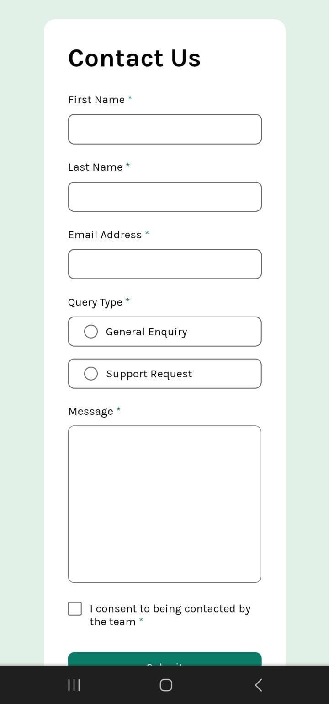

# Frontend Mentor - Contact Form Solution

This is a solution to the [contact form challenge on Frontend Mentor](https://www.frontendmentor.io/challenges/contact-form--G-hYlqKJj). Frontend Mentor challenges help you improve your coding skills by building realistic projects.

## Table of Contents

- [Overview](#overview)
- [The Challenge](#the-challenge)
- [Screenshot](#screenshot)
- [Links](#links)
- [My Process](#my-process)
- [Built With](#built-with)
- [What I Learned](#what-i-learned)
- [Continuous Development](#continuous-development)
- [Helpful Resources](#helpful-resources)
- [Author](#author)

## Overview

### The Challenge

Users should be able to:

- Fill out the form and see a success message upon successful submission
- Receive form validation messages if:
- A required field was missed
- The email address is not formatted correctly
- Fill out the form using only the keyboard
- Have inputs, messages error message and success message announced in screen reader
- See the optimal layout for the interface depending on the device screen size
- See the hover and focus states for all interactive elements on the page

### Screenshot

### Links

- Solution URL: (https://github.com/1IMperaDOR0/formulario-de-contato.github.io)
- Active website URL: (https://1imperador0.github.io/formulario-de-contato.github.io/)

## My process

### Created with

- Markup languages ​​(HTML5 and CSS3)
- Semantic structure
- Flexbox and responsiveness
- Images used (add-links)
- Programming language (JavaScript)
- Interactivity
- Modular functions

### What I learned

In HTML, I learned:
- How to structure a form with semantic tags like <form>, <label>, <input> and <textarea>.
- How to use attributes like data-rules to store validation information in an organized and readable way.
- How to use rel="preconnect" to optimize the loading of external fonts and rel="shortcut icon" to add a custom icon to the browser.

In CSS, I learned:
- How to use Flexbox to create a flexible and responsive layout for the form, adapting it to different screen sizes.
- How to apply styles to different elements of the form, such as inputs, labels, buttons and error messages, creating a consistent and professional look.
- How to use @media queries to create specific styles for different screen sizes, ensuring that the form is visually pleasing on any device.

In JavaScript, I learned:
- How to use addEventListener to add click events to elements, such as checkboxes and radio buttons.
- How to manipulate the DOM (Document Object Model) to add and remove classes, modifying styles and behavior dynamically.
- How to validate user input with custom rules, using JavaScript functions to check if the data is correct. - How to provide visual feedback to the user during the validation process, displaying error messages and success messages with animations.

Overall, the code demonstrates how to:
- Create a complete contact form, from the HTML structure to JavaScript interactivity.
- Implement data validation to ensure the quality of the information.
- Provide visual feedback to improve the user experience.
- Develop a responsive and pleasant interface, adapting to different devices.

### Continuous development

With this challenge I was able to understand how many gaps still need to be filled. In particular, I had greater difficulty manipulating DOM elements with click events, and I had difficulty understanding the concept of the DOM tree in practice. So I need to develop my skills even further so that they are even more refined and I can make the code cleaner and more understandable.

### Useful resources

- [DOM tree concept](https://javascript.info/dom-nodes) - This helped me solve the problems of manipulating DOM elements. I really like this pattern and will be using it from now on.

## Author

- Frontend Mentor - [@1IMperaDOR0](https://www.frontendmentor.io/profile/1IMperaDOR0)
- GitHub - [1IMperaDOR0](https://github.com/1IMperaDOR0)
